<div align="center">
  <h1 align="center">📊 StatViz: The Enterprise Data Science Platform</h1>
  <p align="center">
    <strong>A lightning-fast, fully interactive, no-code alternative to SPSS built for modern researchers and data scientists.</strong>
  </p>
</div>

<p align="center">
  
  
  
  
  <br>
  
  
  
</p>

---

## 🎯 What is StatViz?
**StatViz** completely eliminates the steep learning curve of programming languages and the enormous costs of legacy software (like SPSS and SAS). Access premium tools to confidently filter datasets, hunt down outliers, generate interactive visualizations, run rigorous hypothesis tests, and train complex machine learning models completely visually without writing a single line of code.

---

## 🎬 Platform Previews

<div align="center">
  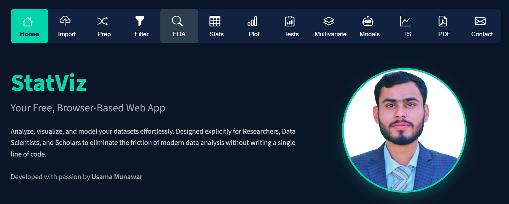
</div>
<br>

| **Intelligent Data Pipeline** | **Exploratory Analytics (EDA)** |
|:---:|:---:|
| 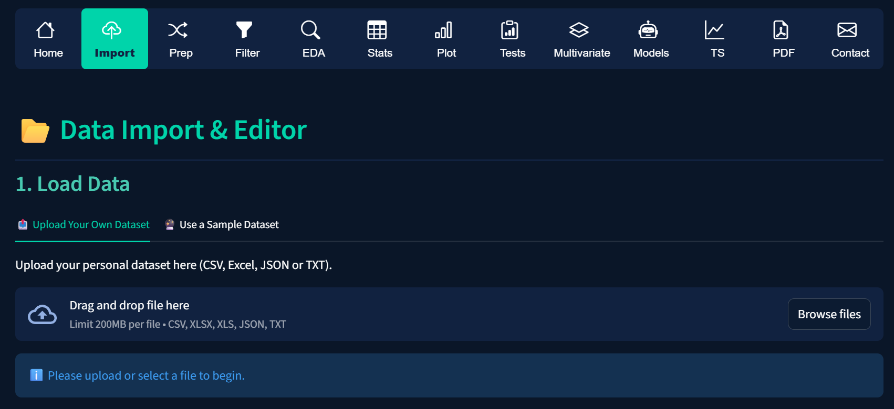 | 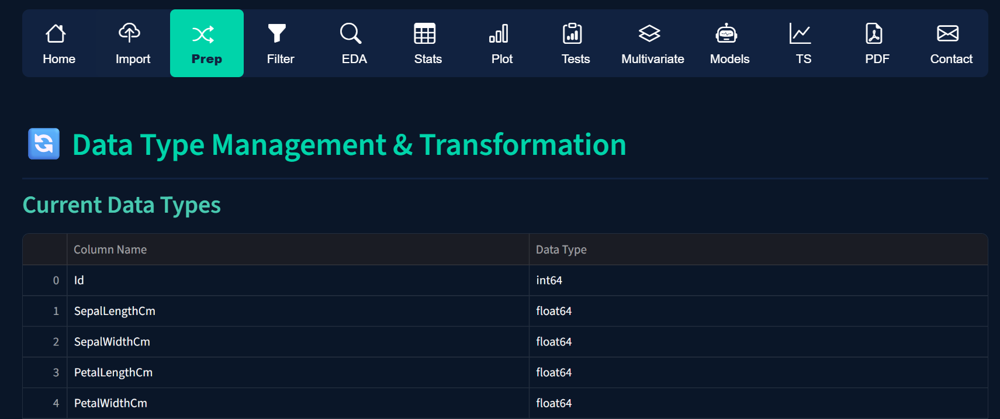 |
| Clean uploads, robust robust type casting, and Z-Score scaling. | Identify distributions, missing value heatmaps, and outlier checks. |

| **Rigorous Hypothesis Testing** | **Advanced Machine Learning** |
|:---:|:---:|
| 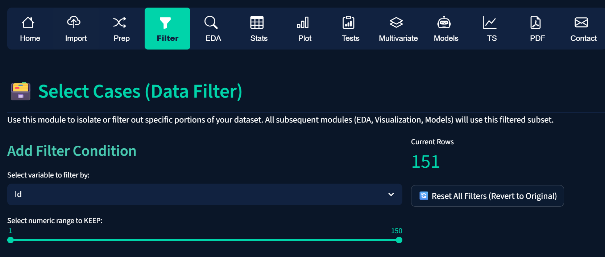 | 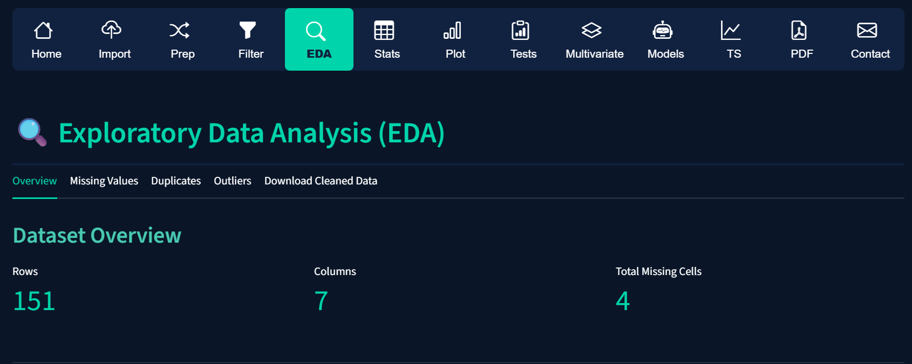 |
| Parametric, Non-Parametric, and pure strict Normality verification. | Train XGBoost, Neural Networks (ANN), and Random Forests. |

| **Multivariate Diagnostics** | **SPSS-Style Statistical Engine** |
|:---:|:---:|
| 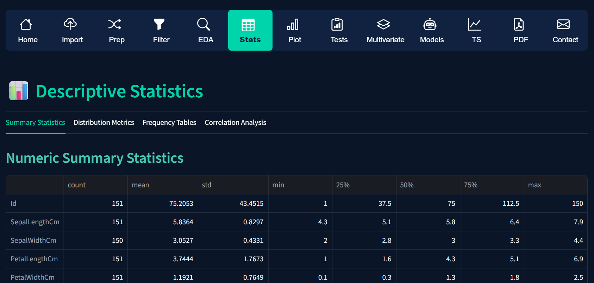 | 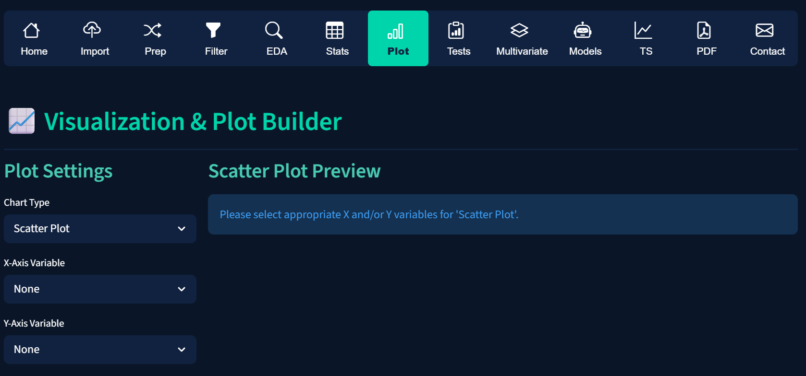 |
| Advanced Dimensionality Reduction (PCA) and Factor Analysis. | True SPSS outputs (B, SE, Beta, Wald, p) and Stepwise Selection! |

<br>
<div align="center">
  <h3>📑 PDF Document Generation & Automated Insights</h3>
  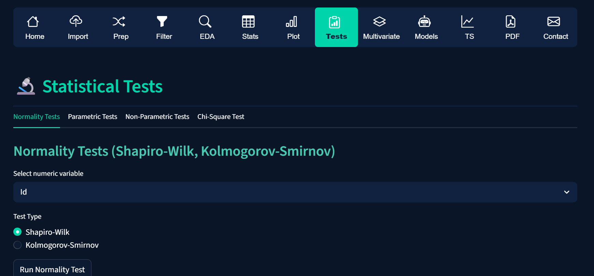
  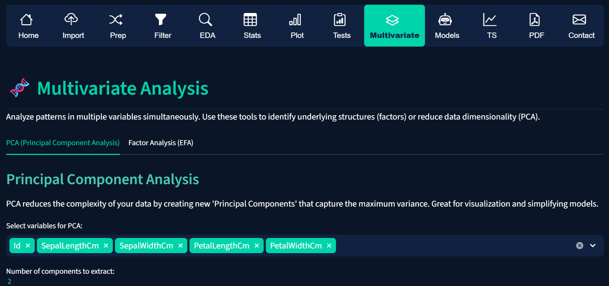
  <p><i>Generate complete, academic-grade analytical reports and fully compiled modeling PDFs directly to your computer.</i></p>
</div>

---

## 🌟 Core Features & Modules

### ⚙️ 1. Complete Data Preparation
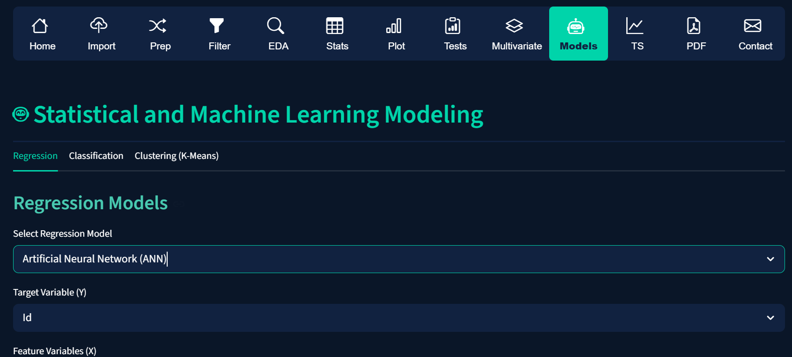

- **Instant Connectivity:** Work seamlessly with `.CSV`, `.Excel`, or load built-in Sandbox APIs instantly.
- **Smart Formatting:** Convert variables, encode distinct categorical elements (Label Encoding natively built-in), and dynamically inject **Z-Score** or **Min-Max Scaling** with one beautiful click.
- **Master Filters:** Subset your entire dataset gracefully based on multi-variate continuous or categorical conditions. Global filters impact the entire app lifecycle perfectly.

<br clear="both"/>

### 🔍 2. Precision EDA (Exploratory Data Analysis)
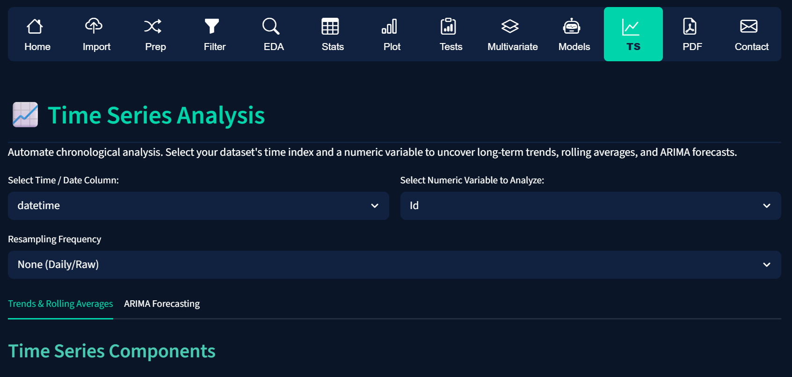

- **Visual Missingness:** Use integrated Seaborn heatmaps to scan data voids, and deploy mean/median/mode imputations automatically to save time.
- **Zero-Tolerance Outliers:** Spot statistical anomalies via high-definition boxplots and Winsorize or terminate them immediately to protect model validity.

<br clear="both"/>

### 📈 3. Uncompromised Analytics & Plotting
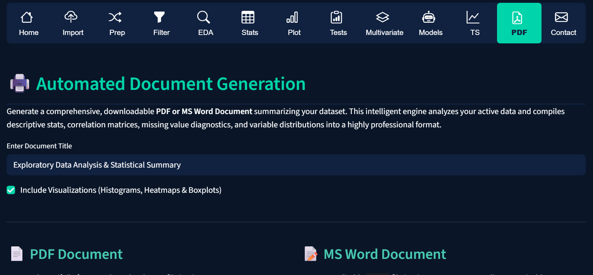

- **Custom Charts:** Render 3D Scatters, high-resolution Histograms, and dynamic Pie charts powered by Plotly.
- **Multivariate Power:** Reveal latent dimensions leveraging **Principal Component Analysis (PCA)** and **Exploratory Factor Analysis (EFA)**, complete with eigenvalue outputs and Component Loadings Matrices.
- **Core Statistics:** Fast extraction of shape, distribution variance, and central tendencies natively.

<br clear="both"/>

### 🦾 4. No-Code Machine Learning


- **Zero Syntax Needed:** Fit extremely powerful Regressors and Classifiers (Random Forest, SVM/SVC, KNN, XGBoost, ANN).
- **SPSS Stepwise Engines:** Select features flawlessly using automated Forward, Backward, and Stepwise methods exactly like SPSS.
- **Control Parameters (Hyper-Tuning):** Easily maneuver learning rates, Neural Network Hidden Layers, K-neighbors, and tree-depths via dashboard sliders.
- **Feature Importance Tracking:** Extract both Impurity-based and robust Permutation Feature Importance plots natively!
- **Deployment Ready:** Found the perfect model? Download the `.pkl` files and seamlessly transfer them to your production systems!

<br clear="both"/>

### 🤖 5. Automation & Time-Series
- **Temporal Forecasting:** Leverage embedded ARIMA techniques to graph sequential time-data trends actively.
- **Report Fabrication:** StatViz computes data summaries and builds Correlation Matrices natively—printing pristine PDF or easily editable `MS Word (.docx)` academic reports exactly formatted in Times New Roman.

---

## 🛠️ The Tech Architecture
> **StatViz** relies on a blazing fast, top-tier modern Python backend:

| Capability         | Powered By |
|--------------------|------------|
| **Core UI Engine**    | `Streamlit` |
| **Data Orchestration**| `Pandas`, `NumPy` |
| **Machine & Stat ML** | `Scikit-Learn`, `XGBoost`, `Statsmodels` |
| **Visual Renderers**  | `Plotly Express`, `Seaborn` |
| **Report Generators** | `FPDF2`, `Python-Docx` |

---

## 🚀 Quick Start Guide

**1. Clone the project locally**
```bash
git clone https://github.com/UsamaMunawarr/StatViz.git
cd StatViz
```

**2. Isolate the environment & install the core**
```bash
python -m venv .venv
.\.venv\Scripts\activate
pip install -r requirements.txt
```

**3. Ignite the Platform**
```bash
python -m streamlit run app.py
```
*Your browser will instantly launch the StatViz interface.*

---

## 👨‍💻 Developed By

<div align="center">
  <h2 style="color:#00d4aa; font-size: 24px; font-weight: bold;">Usama Munawar</h2>
  <a href="https://github.com/UsamaMunawarr"></a>
  <a href="https://www.linkedin.com/in/abu--usama"></a>
  <a href="https://www.youtube.com/@CodeBaseStats"></a>
  <a href="https://twitter.com/Usama__Munawar"></a>
  <a href="https://www.facebook.com/profile.php?id=100005320726463"></a>
  <br>
  <br>
  <p><b>Data Analytics | Machine Learning | Backend Architecture</b></p>
  <i>If StatViz elevates your research or adds value to your data journey, please grant this repository a ⭐ to support open-source tooling!</i>
</div>
